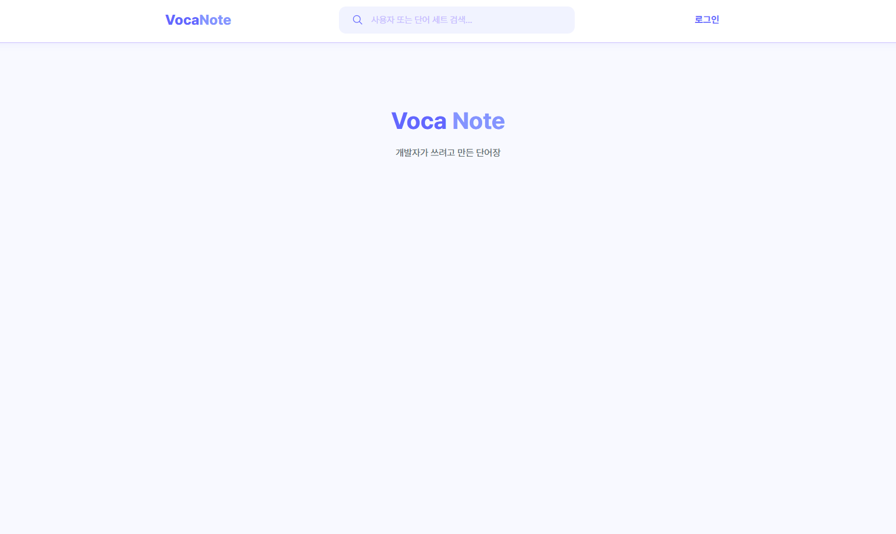
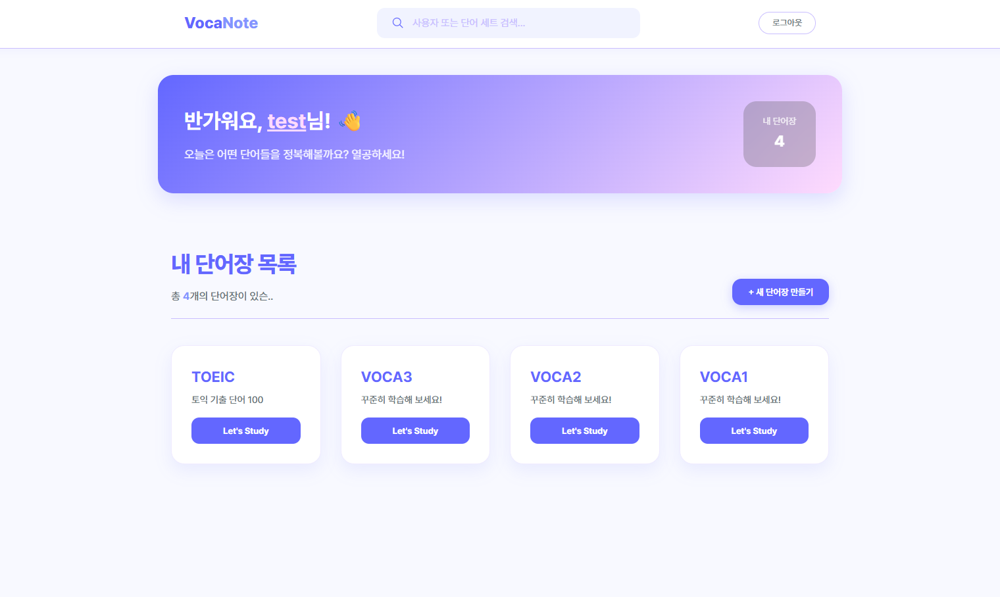
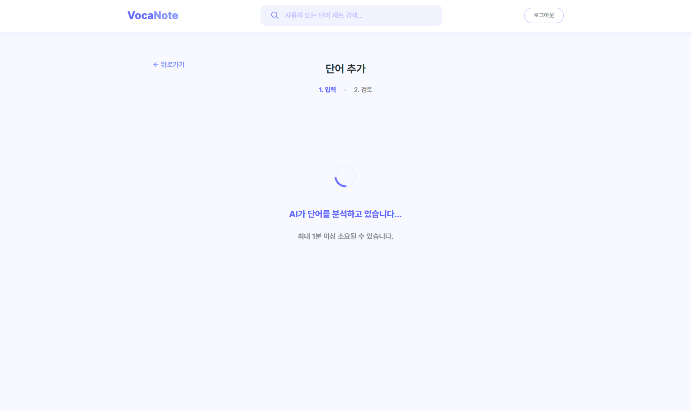
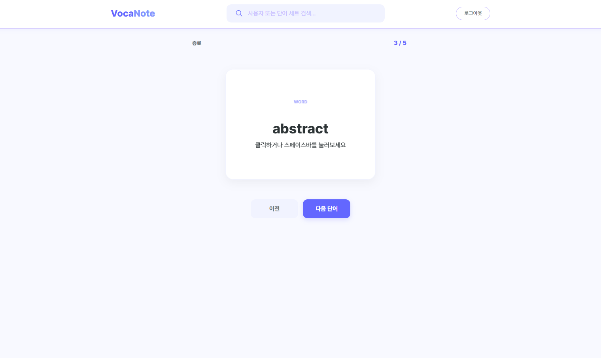
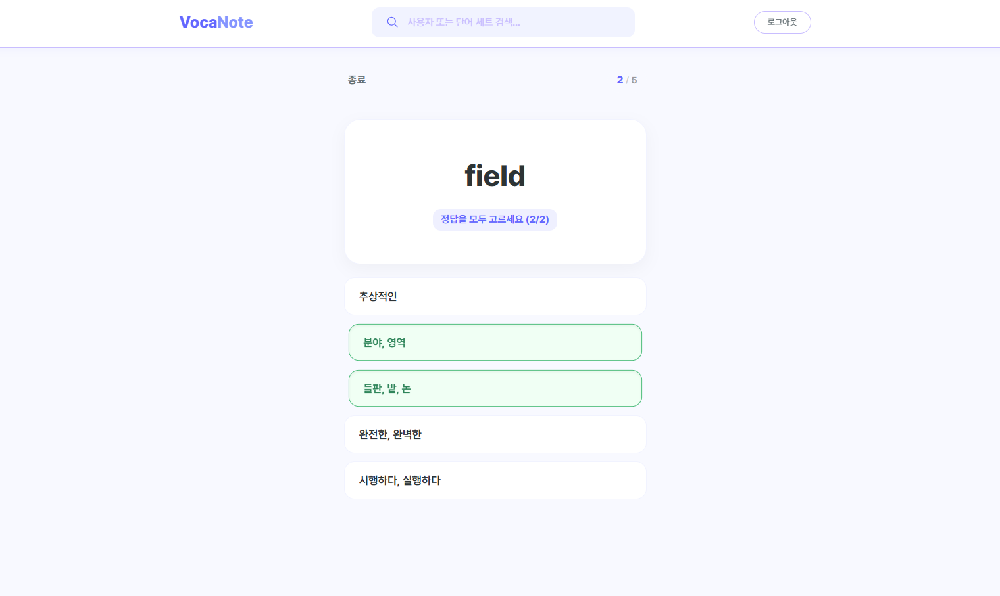
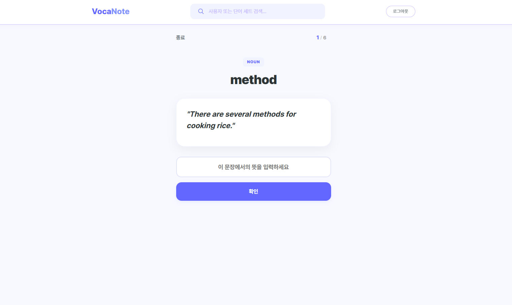

# VocaNote

> 나만의 단어장을 만들고 플래시카드, 퀴즈, 예문 연습으로 단어를 완벽하게 익히세요.



[English](README.md)

---

## 기능

- **인증** — 회원가입 및 로그인으로 나만의 단어장 관리
- **단어장** — 단어장 생성, 검색, 탐색
- **단어 추가** — 단어와 뜻 추가, AI 자동 분석 지원
- **학습 모드**
  - 플래시카드 (`study/card`)
  - 객관식 (`study/multiple`)
  - 쓰기 연습 (`study/write`)
- **검색** — 단어장 검색

## 스크린샷

### 단어장 목록



나의 단어 컬렉션을 한눈에 확인하고 관리하세요.

### 단어 추가 — AI 분석



단어를 입력하면 AI가 자동으로 뜻을 분석하고 제안해줍니다.

### 학습: 플래시카드



### 학습: 객관식



### 학습: 쓰기 연습



## 기술 스택

- [React](https://react.dev/)
- [Vite](https://vite.dev/)
- [Axios](https://axios-http.com/)
- [React Icons](https://react-icons.github.io/react-icons/)

## 시작하기

### 사전 요구사항

- Node.js
- npm

### 설치

```bash
npm install
```

### 개발 서버 실행

```bash
npm run dev
```

### 빌드

```bash
npm run build
```

## 배포

이 프로젝트는 [Vercel](https://vercel.com/) 배포를 위한 [vercel.json](vercel.json)을 포함하고 있습니다.